# ESP32 Sensor Sampling Board

**原文连接**：

1. 私人项目：[Martin-soaring-dev/esp32_sampling_board_private](https://github.com/Martin-soaring-dev/esp32_sampling_board_private)
2. 公开项目：[Martin-soaring-dev/esp32_sampling_board](https://github.com/Martin-soaring-dev/esp32_sampling_board)

# 用户手册

## 1. Get start

### (1) 工具准备

- 可以从这里[^1]获取ESP32的下载工具。在/frimware/tool路径下也添加了该工具。
- 安装上位机<**SensorSamplingBoard_web.exe**>。

### (2) 下载firmware

相关配置参考了[^2]的经验。

打开工具后，按照下图进行选择操作：

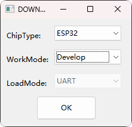

然后点击OK进入图形界面：

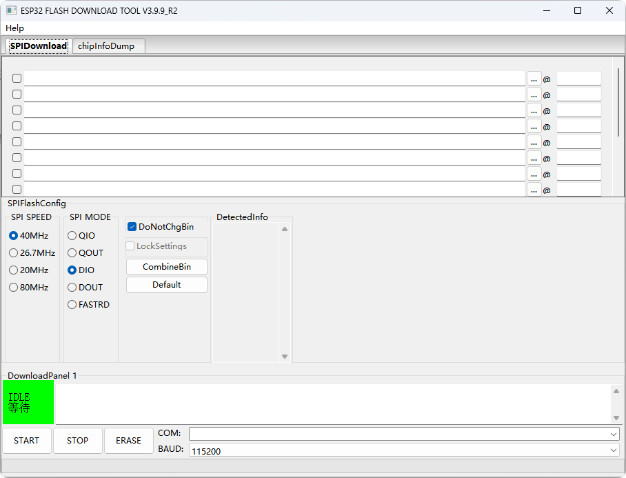

Step 2 然后按照下图选择文件：

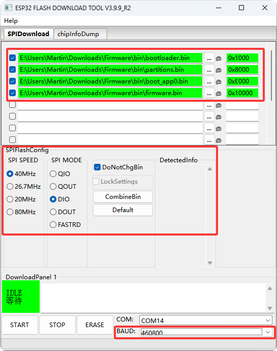

具体来说，按照下表进行配置即可

| 文件名         | 地址    |
| -------------- | ------- |
| bootloader.bin | 0x1000  |
| partitions.bin | 0x8000  |
| boot_app0.bin  | 0xE000  |
| firmware.bin   | 0x10000 |

SPI Flash Config 保持图中的默认设置即可

波特率选择为：460800

COM口根据实际情况选择，查看方法为，此电脑→右击→管理→设备管理器→端口→查看连接ESP32后新出现的COM口

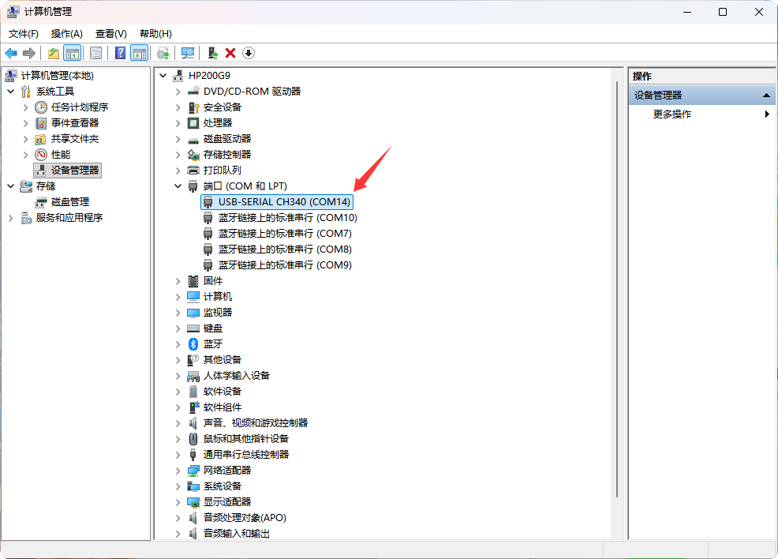

然后先进行**擦除**，点击""**ERASE**""，清空Flash中的数据：

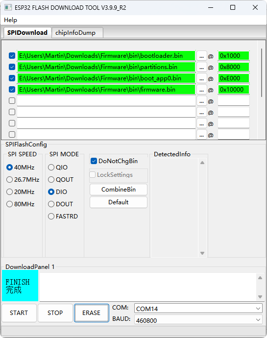

然后进行下载，点击"**START**"，开始下载数据：

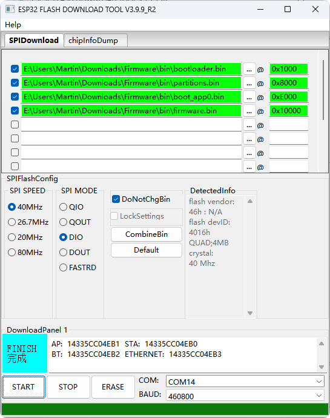

### (3)上位机连接与测试下载是否成功

打开<**SensorSamplingBoard**>

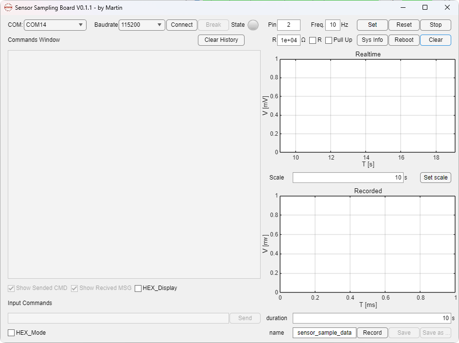

选择合适的COM和波特率115200，点击连接，连接成功且固件成功下载时，会返回如下信息，最后一条应为esp32_sampling_board_online：

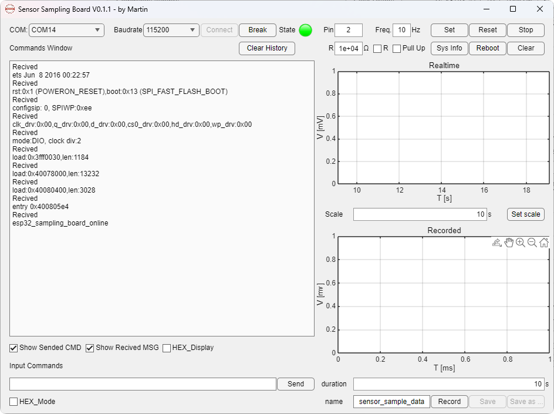

## 2. 采集功能

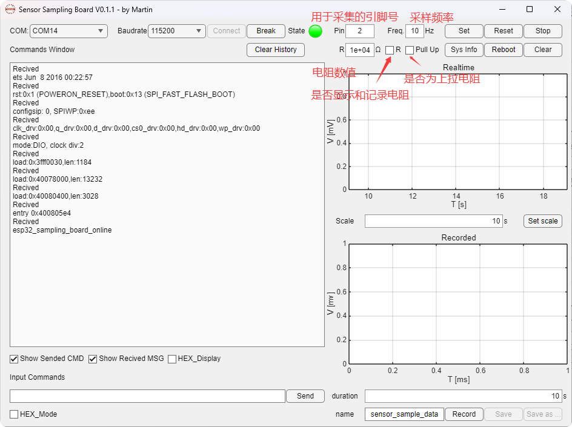

#### 基本功能

- Pin: 用于采集的引脚序号，目前支持的引脚为2,4,12,13,14,25,26,27,32,33,34,35,36,39，如果输入错误会弹窗

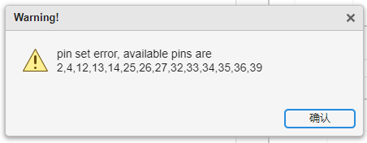

- Freq. 采样频率≤100Hz，不建议大于60Hz，稳定性会变差。
- R: 设置测阻电路中参考电阻的阻值。
- 复选框R，如果勾选，则在会图框显示R，并在保存数据时，增加电阻数值。
- 复选框Pull up：测阻电路有两种接法，参考电阻可能为上拉电阻或者下拉电阻，默认为下拉电阻；如果接线时参考电阻为上拉电阻，请勾选。


- Set按钮：设置完Pin和Freq后可以点击Set以进行配置，之后会不断采集pin的引脚数据并显示在Realtime的窗口中。

  - 如果频率设置的比较高，返回的数据在command window中太多，可以取消勾选show received MSG。

- Reset按钮：点击Reset按钮后，会重置时间戳为0ms。

- Stop按钮：点击后会停止采集。

- Sys info按钮：点击后显示系统信息：包括串口信息、引脚配置、引脚数值

- Reboot：重启采集板

- Clear：清空绘图区

- Set Scale，绘图区显示的时间范围

  

## 3. 记录功能

**概览**：

使用基本功能完成测试后，如果有需要可以进行记录

记录时间范围最长为24小时×60小时/分钟×60秒/分钟×60Hz=5,184,000个数据点，可以根据采样率Freq进行计算最大采样时长。填入duration。

**功能介绍**：

1. 自动保存：默认开启。默认保存路径为"C:\Users\用户名\AppData\Local\Temp\SensorSamplingBoard\untitled.txt"，在记录完成后就会自动保存。
2. 开始采集：然后可以点击Record按钮，开始记录。开始记录后Record按钮会被按下，Set, Reset, Stop, Preview会变成灰色。

2. 停止采集：当达到记录时长后，Record按钮会弹起，Set, Reset, Stop, Preview, Save as按钮可以使用；如果希望提前终止记录，可以点击Record按钮，然后回提示用户是否取消采集，确认后即可停止采集（不会删除已记录的数据）。

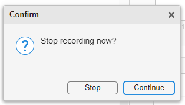

3. 采集完成：
   - 保存数据：用户可以点击Save as保存为txt，csv或excel表格。
   - 预览数据：用户可以点击Preview，数据会绘制在recorded图窗中。如果数据量大于1e4，则会被稀疏化为1e4个数据，避免内存溢出。

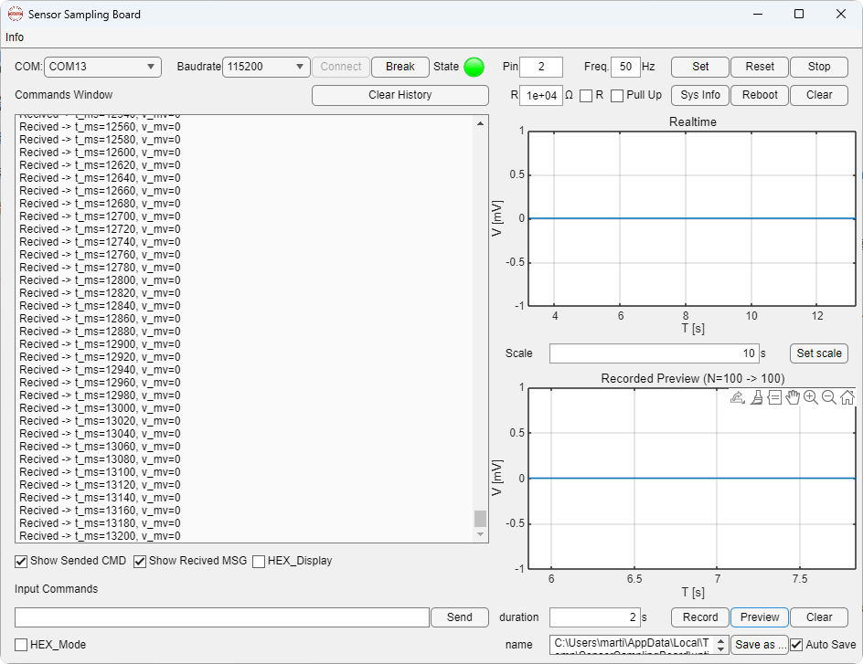

## 4. 高级功能（手动操作）

用户界面支持用户手动发送指令进行操作，现在把支持的指令列出：

- I01 DXX SYY: 设置端口XX以YY频率采样。

- I02: 重置时间戳

- I03: 停止采集

- I114: 查询系统状态

- I999: 重启采集板

# 技术手册

## 1. Hardware

### 1.1 ESP 32

### 1.2 检测电路

## 2. Firmware

基于 ESP32（Arduino 框架）的多通道采样与串口通信固件。

### 2.1 功能概览

- 串口命令控制采样流程
- 底层 ADC 扫描中断（`2000us` 周期）
- 用户采样发布中断（由 `I01` 的 `S` 参数控制）
- 环形缓冲区缓存采样包并由主循环发送
- 缓冲溢出错误检测与停采样处理
- `I114` 状态查询（包含 ISR 统计）
- `I999` 设备重启

### 2.2 命令协议（ASCII）

命令以换行结束（`\r`/`\n`）。

- `I01 ...`：模态配置采样参数（可选参数、顺序无关）
  - `I01 D03`：仅修改采样引脚
  - `I01 S60`：仅修改采样频率
  - `I01 D03 S60` 或 `I01 S60 D03`：同时修改
- `I02`：按上次有效配置重启采样，并将时间戳清零
- `I03`：停止采样
- `I114`：输出系统状态（ASCII）
- `I999`：重启设备

错误输出：

- `Error Code 01: incorrect pin`
- `Error Code 02: incorrect sampling frequency`
- `Error Code 03: Cache overflow`

### 2.3 采样与中断模型

- 扫描中断：`ADC_SCAN_PERIOD_US`（默认 `2000us`）
  - 读取启用通道的 ADC 值，更新最新电压快照
- 发布中断：按用户频率周期触发
  - 将最新快照打包并写入环形缓冲区
- 主循环
  - 串口收命令
  - 发送缓冲区数据
  - 处理溢出与状态输出

### 2.4 数据帧（二进制）

每个采样包格式：

- `[0xAA][0x55]`
- `timestamp_ms`（4B，小端）
- `enabled_mask`（2B，小端）
- `10 * voltage_mv`（每路 2B，小端）
- `[0x0D][0x0A]`

### 2.5 代码结构

- `src/main.cpp`
  - 程序入口（`setup/loop`）与调度
- `src/serial/serial_io.*`
  - 串口收发、命令缓存、二进制发包
- `src/serial/serial_parser.*`
  - 命令解析（`code + number + 参数`）
- `src/serial/serial_command.*`
  - 命令执行流程（解析结果 -> 执行动作）
- `src/adc/adc_sampler.*`
  - 定时器、ISR、环形缓冲、统计、快照
- `src/command/i01~i999.*`
  - 各指令业务逻辑
- `src/hw/pin_capability.*`
  - 引脚能力判定
- `src/configuration.h`
  - 全局配置常量与共享结构体

### 2.6 编译（PlatformIO）

```bash
platformio run
```

默认环境见 `platformio.ini`。

## 3. Software

待完善

# 参考

[^1]: [Flash 下载工具用户指南 - ESP32 - — ESP 测试工具 latest 文档](https://docs.espressif.com/projects/esp-test-tools/zh_CN/latest/esp32/production_stage/tools/flash_download_tool.html#id5)
[^2]: [【ESP32之旅】ESP32 PlatformIO 固件单独烧录_esp32固件-CSDN博客](https://blog.csdn.net/Argon_Ghost/article/details/139307638)
